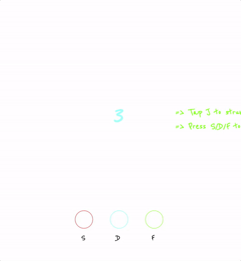

# Guitar Gyro

[Play Guitar Gyro][GuitarGyro]
[GuitarGyro]: http://philmayer.github.io/Guitar-Gyro

## Gampeplay
Guitar Gyro is a browser game based on the classic home console game Guitar Hero. Players choose from among one of four difficulty levels, with each level increasing successively in tempo. Soon after the fateful decision is made, colored circles will begin descending the screen, each circle representing a single note of the melody.

In order to "hit" a note, the player must be holding the correct note (S, D, or F keys) and strumming (J key) when the note overlaps with our "instrument" on the screen's bottom. If that was all a bit confusing, here's a gif that will hopefully clear things up a bit:



## Technical Details

Guitar Gyro is written in plain old JavaScript, with just two classes. The first of these is the `Game` class, which does exactly what it sounds like--deploying notes downscreen, handling the logic of what happens when a player hits or doesn't hit a note, and displaying pre- and post-game messages.

### `MusicPlayer`
The second and more interesting class is the `MusicPlayer` class, which deals with creating a tune, and then turning that tune into something that can be ready to sync with the circular note visuals.

We start by importing a melody, which is simply an array of notes that looks like this:

```javascript
export const melody = [
  'E3  q',
  'E3  q',
  'F3  q',
  'G3  q',

  'E3  qe',
  'D3  e',
  'D3  h'
```

The note names are the first term in the array item (i.e. E3, D3), while the term after the space is the note duration (i.e. quarter, quarter-eighth, eighth, half or whole). To get the rhythm of the tune, a regular expression is employed:

```javascript
const regExp = /\d\s*(.*)/
```
From here, we call `MusicPlayer`'s `mapNoteToDuration`, which turns our note value into a duration in seconds, based on the chosen tempo.

```javascript
mapNoteToDuration (noteLength) {
  switch(noteLength) {
    case "e":
      return ((60 / this.tempo) / 2)
    case "q":
      return (60 / this.tempo)
    case "qe":
      return ((60 / this.tempo) * 1.5)
    case "h":
      return ((60 / this.tempo) * 2)
    case "w":
      return ((60 / this.tempo) * 4)
  }
}
```

Multiplying this by 1000, we have the delay in milliseconds to provide to `setTimeout`.

### `deployNote`

The `Game` class function `deployNote` is what actually sends our notes cascading towards their fate. For each note, a new shape is created in Easel and sent down the screen at a rate of 8 pixels every 1/60th of a second, but only after the aforementioned setTimeout delay determined from `mapNoteToDuration`.

Finally, each note recursively calls `deployNote` on the next note until we reach the end of the tune.

## Make your own Guitar Gyro!
Guitar Gyro will work with any tune, at any tempo. So, to play your own song, all you need do is clone this repo, plug in a new melody (and optionally bass) in 'melody.js', and have at it.
